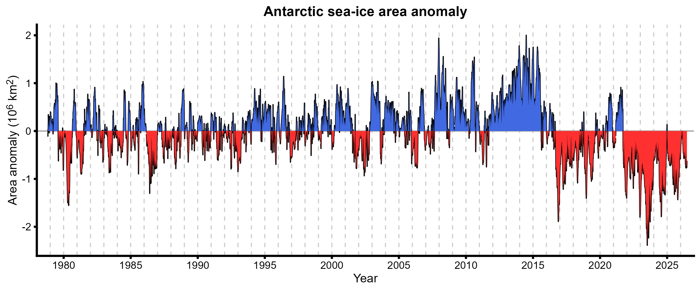
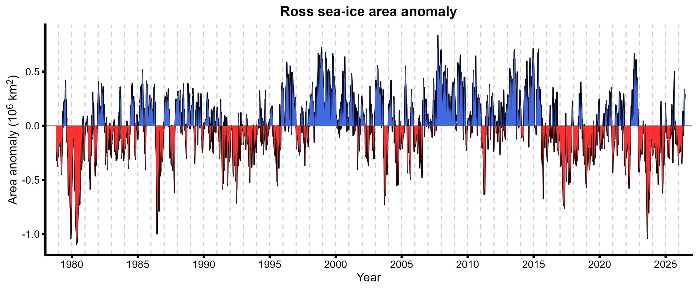
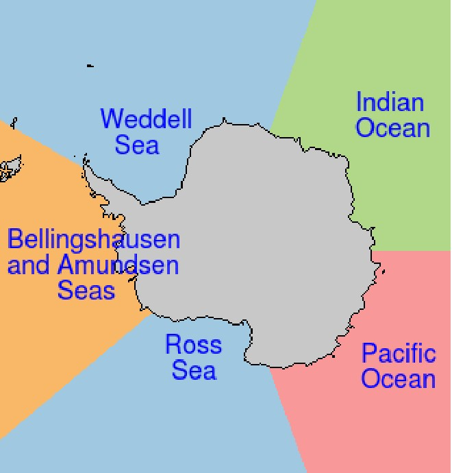

# Daily sea-ice anomalies around Antarctica

Last updated 2026-06-25.

This repository scrapes the NSIDC daily [Antarctic sea-ice
datasets](https://nsidc.org/sea-ice-today/sea-ice-tools) (area, extent),
extracts by-sector and pan-Antarctic datasets, then plots anomalies for
each.

Navigate to the [plots
folder](https://github.com/GNS-NICRF/Daily-sea-ice-live) for individual
series charts with shaded and unshaded versions. Two examples are shown
below.

Ocean sector/region definitions used by the NSIDC are shown below,
pulled from their
[documentation](https://nsidc.org/sites/default/files/documents/technical-reference/sea-ice-analysis-spreadsheets-overview.pdf):

Matt Harris

<matt.harris@earthsciences.nz>

[Antarctic Sea-Ice Switch](https://seaice.aq/)
